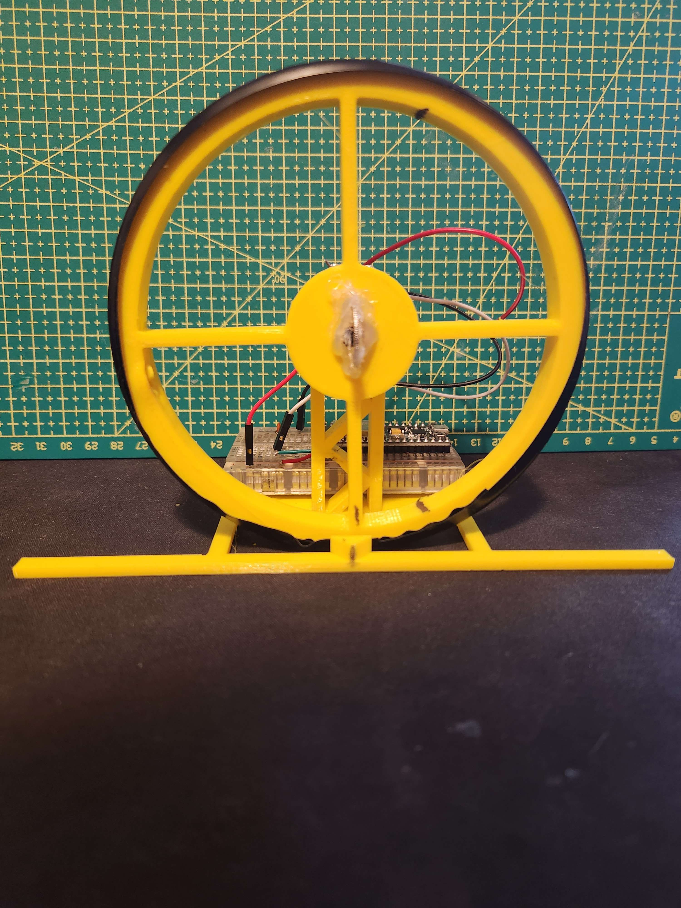
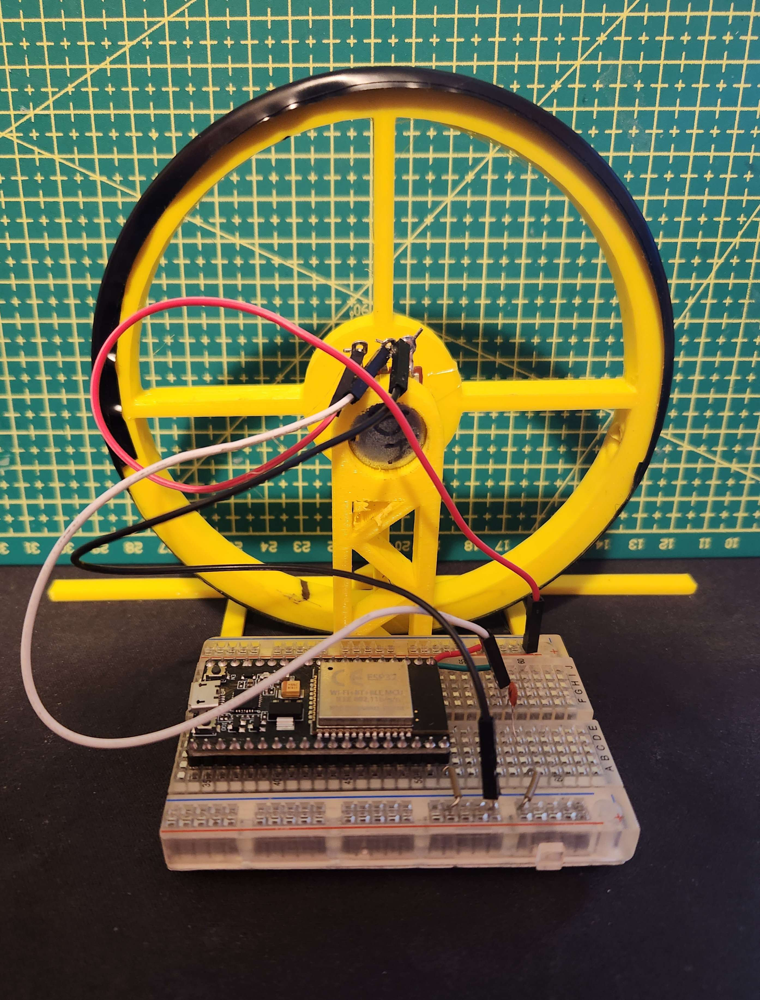
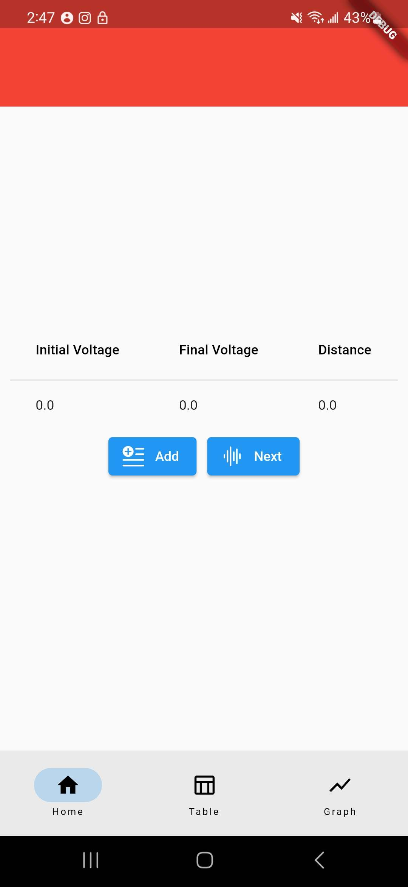

# Distance Measurement App

This Flutter app connects to an ESP32 websocket server to gather distance measurements from my personalyl designed measurement device and includes a home page for connecting to the websocket server, a table page for you to save measurements to, and a graph page for you to select data to graph.

The app is built using Flutter, a popular open-source framework for building high-quality, cross-platform mobile apps. Flutter makes it easy to create beautiful, responsive user interfaces and to integrate with other technologies like websockets. With Flutter, you can build apps for both iOS and Android with a single codebase, saving time and effort.

## Getting Started

To get started with this app, you will need to have Flutter installed on your computer. You can download and install Flutter by following the instructions on the official Flutter website: https://flutter.dev/docs/get-started/install.

Once you have Flutter installed, you can clone this repository and run the app on your device or emulator. To clone the repository, run the following command in your terminal:

```
git clone https://github.com/Jackiele123/Distance_Measurement_App.git
```

Once you have cloned the repository, navigate to the project directory and run the following command to install the app's dependencies:

```
flutter pub get
```

You can then run the app using the following command:

```
flutter run
```

STL Files for all the 3D Printed Parts have been included and the only other parts are a potentiometer and wires.

## Home Page

The home page of the app includes a form where you can enter the IP address and port number of the websocket server. Once you have entered the server information, you can click the "Connect" button to connect to the server.

## Table Page

The table page of the app displays a table of distance measurements that have been received from the websocket server. You can add new measurements to the table by clicking the "Add Measurement" button and entering the distance measurement in the form that appears.

## Graph Page

The graph page of the app allows you to select data to graph from the distance measurements that have been received from the websocket server. You can select the data to graph by using the drop-down menus at the top of the page. Once you have selected the data to graph, the app will display a graph of the selected data.

## The ESP32 and Mobile Application Connection

To enable the app to signal the ESP32 device to take a distance measurement, I programmed the ESP32 to act as a websocket server. The app establishes a websocket connection with the server and sends a signal to the device to take a measurement. The device then takes the measurement and sends the data back to the app over the websocket connection. The app can then display the measurement in a user-friendly way and allow the user to save it to a table or graph it over time. By using the ESP32 websocket server, I was able to create a flexible and efficient system for gathering and analyzing distance measurements using my Flutter app.

## How it works

To measure distance using the ESP32 device, I programmed it to measure the change in voltage of a potentiometer as a proxy for distance. I then used calipers to measure the actual distance and plotted the corresponding voltage on a graph. By doing this for several distances, I was able to create a trendline that related the change in voltage to the actual distance. This allowed me to convert the voltage readings from the potentiometer into accurate distance measurements, with a maximum uncertainty of +/- 0.6mm. By using this method, I was able to create a reliable way to measure distance using the ESP32 device.

## Measuring Procedure

To use the app to measure distance with the ESP32 device, first position the device at the beginning of the area you want to measure, and click the "Measure" button on the home page of the app. The app will signal the device to take a measurement, and the distance measurement will be displayed on the home page of the app. Next, move the device to the end of the area you want to measure, and line it up with the endpoint. Then, click the "Measure" button again to take a second measurement. After both measurements are taken, the device will calculate the distance and display it on the home page of the app. You can then add all the readings, including the distance calculation, to the table page of the app by clicking the "Add to Table" button. The app also allows you to select the data to be graphed on the graph page. This simple procedure allows you to easily and accurately measure distances using the ESP32 device and the app.

## Conclusion

That's it! With this app, you can connect to an ESP32 websocket server to gather distance measurements and display them in a table or graph. If you have any questions or feedback, feel free to reach out to me. Thank you for using my app!

## Images

  
